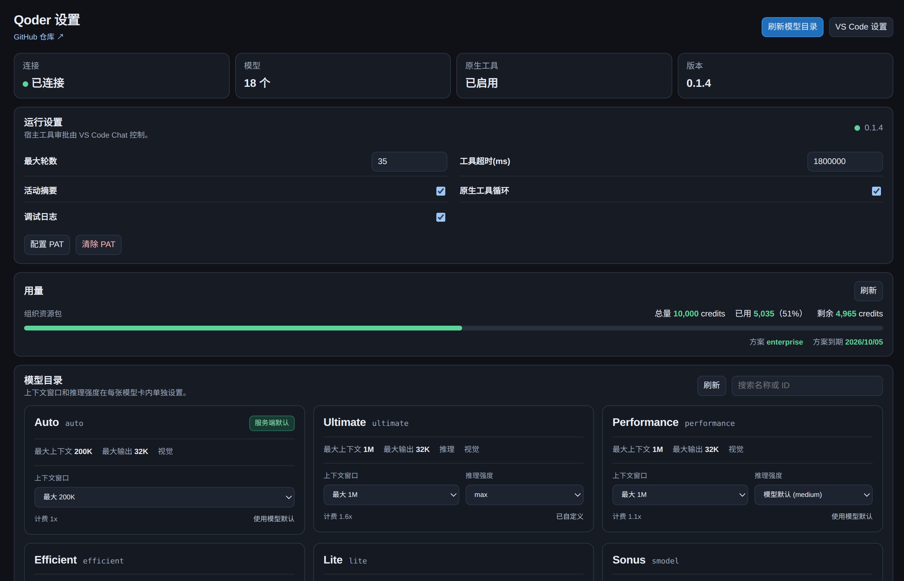

# Qoder VS Code Bridge

把企业版 Qoder 接入 VS Code 原生 Chat。安装后，在模型选择器中选一个 Qoder 模型即可开始对话。

[English](README.en.md) · [Releases](https://github.com/qianxunslimg/qoder-vscode-bridge/releases)



## 安装

需要 VS Code `1.106.0` 或更高版本，以及 Node.js/npm。

1. 从 [Releases](https://github.com/qianxunslimg/qoder-vscode-bridge/releases) 下载 `.vsix`。
2. 在 VS Code 执行 `Extensions: Install from VSIX...` 并选择文件。
3. 执行 `Developer: Reload Window`。

也可以从源码打包：

```sh
npm install
npm run package
```

## 开始使用

1. 执行 `Qoder: Set Personal Access Token`，令牌会保存到 VS Code SecretStorage。
2. 打开 Chat，在模型选择器中选择 `Qoder` 下的模型。
3. 需要更新模型列表时执行 `Qoder: Refresh Model Catalog`。
4. 执行 `Qoder: Open Control Center` 查看模型能力和运行设置。

不需要输入 `@qoder`。清除令牌可执行 `Qoder: Clear Personal Access Token`。

## 支持的能力

- 使用 VS Code 原生 Chat 和模型选择器。
- 从账号目录加载可用模型，并按模型保存上下文窗口和 reasoning effort。
- 传递文件、文件内选区、粘贴文本和图片引用。
- 使用 VS Code 提供的 Bash、Read、Edit 等宿主工具，并把结果返回同一个会话。
- 查看账号用量、方案和服务端返回的到期信息。

## 控制中心

运行设置（最大轮数、工具超时、活动摘要等）是用户级设置；模型卡片里的上下文窗口和推理强度按模型 ID 保存，切换项目或会话不会重置。

宿主工具的审批由 VS Code Chat 控制，扩展不再提供权限下拉框。没有宿主工具、走 SDK 回退路径时，扩展内部仍使用 `bypassPermissions`。

## 配置项

可在 VS Code 设置中搜索 `Qoder Bridge`，也可以直接编辑用户设置。

| 配置项 | 默认值 | 作用 |
| --- | --- | --- |
| `qoderBridge.modelOverrides` | `{}` | 按模型保存上下文窗口和 reasoning effort。 |
| `qoderBridge.maxTurns` | `30` | 单次请求最多执行的 Agent 循环轮数。 |
| `qoderBridge.includePartialMessages` | `true` | 尽可能显示流式文本增量。 |
| `qoderBridge.showActivity` | `true` | 显示工具、任务、重试和完成摘要。 |
| `qoderBridge.nativeToolLoop` | `true` | 使用 VS Code 原生工具循环。 |
| `qoderBridge.nativeToolResultTimeoutMs` | `300000` | 等待宿主工具结果的最长时间（毫秒）。范围 `5000`-`1800000`。 |
| `qoderBridge.debugLogging` | `true` | 在扩展宿主日志中记录链路元数据，不记录 prompt、文件内容或令牌。 |
| `qoderBridge.maxNativeTools` | `91` | 单次请求暴露的宿主工具上限。 |
| `qoderBridge.maxInlineReferenceChars` | `24000` | 选区或粘贴文本直接放入 prompt 的字符上限。 |

## 文件和图片

- 选区和粘贴文本会作为有界上下文发送。
- 完整文件通常由 VS Code 的 `read_file` 工具按需读取。
- 图片需要选择账号目录中标记为“视觉”的模型。
- `qoder_read_file` 只是回退工具，只能读取当前工作区内的 UTF-8 文件。

## 常见问题

- **模型目录为空**：先配置 PAT，再执行 `Qoder: Refresh Model Catalog`。
- **图片或引用没有生效**：图片需要视觉模型；完整文件依赖 VS Code 的 `read_file` 工具，工作区外路径不能由回退工具读取。
- **长任务超时**：提高 `qoderBridge.nativeToolResultTimeoutMs`；打开 `qoderBridge.debugLogging` 后查看 Qoder 扩展宿主日志。
- **`session expired`**：先等待或取消仍在运行的宿主工具，再使用 Chat 的重试操作。

## 开发

```sh
npm install
npm test
npm run package
```

按 `F5` 可启动 Extension Development Host。真实账号 smoke 测试从环境变量读取 PAT，例如：

```sh
QODER_PERSONAL_ACCESS_TOKEN='你的PAT' npm run catalog:smoke
```

## 许可证

MIT
